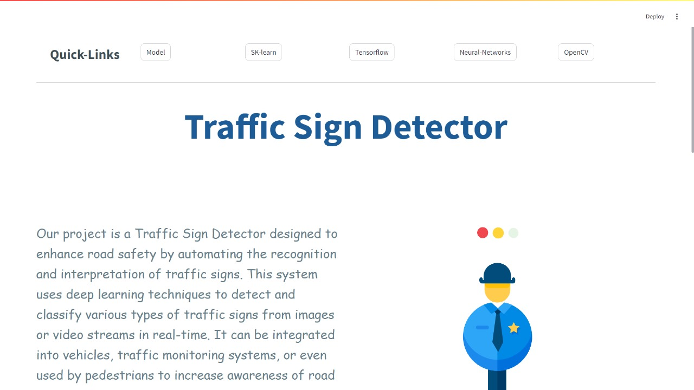
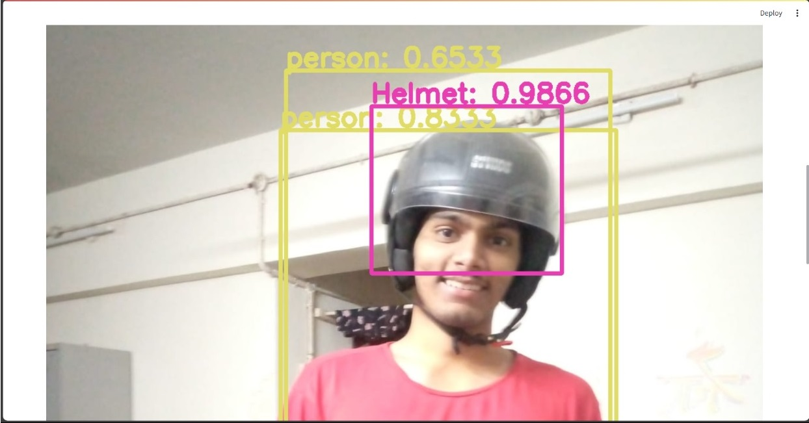
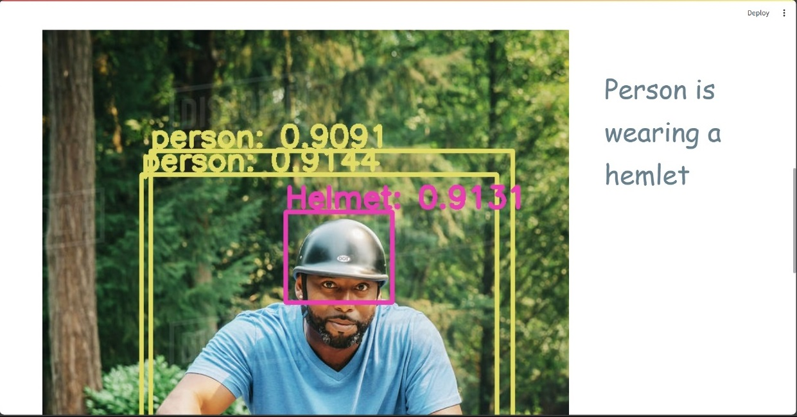
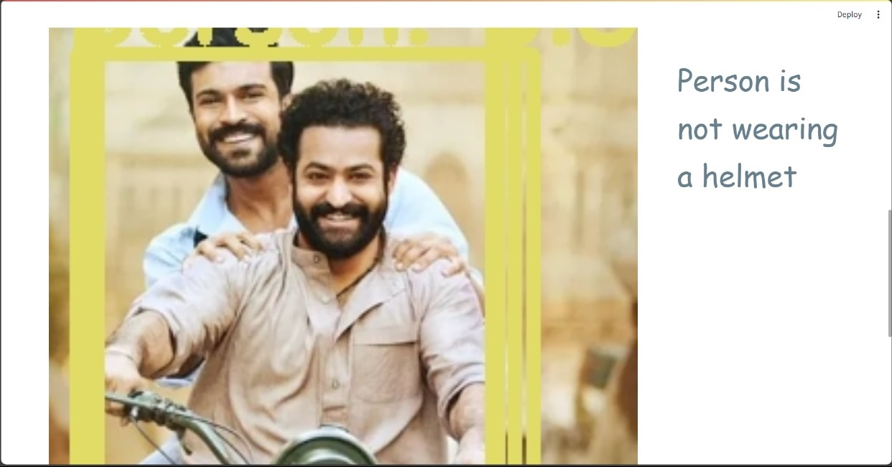

# Helmet Detection Project

This repository contains a mini project for detecting helmets using a pre-trained YOLOv5 model. Follow the steps below to set up and run the project.

## Getting Started

### Prerequisites

Ensure you have the following software installed:
- Python 3.x
- Streamlit
- Required Python libraries (can be installed via `requirements.txt`)

### Installation

1. **Download the Dataset**:
   - Download the dataset from [Kaggle: Person with Helmet](https://www.kaggle.com/datasets/eddumusagar/person-with-helmet).
   - Unzip the downloaded dataset to a desired location on your computer.

2. **Download Project Files**:
   - Download the following files and place them in the same directory where you have unzipped the dataset:
     - `WEB.py`  (In this code, you need to change the output file directory to your custom one)
     - `helmet_detection.py`
     - `Input_images_jpg`(add this by your own)

3. **Install Dependencies**:
   - Open a terminal or command prompt.
   - Navigate to the project directory.
   - Run the following command to install the required Python libraries:
     ```bash
     pip install -r requirements.txt
     ```

### Running the Application

1. **Run the Streamlit Application**:
   - In the terminal or command prompt, navigate to the project directory.
   - Run the following command to start the Streamlit application:
     ```bash
     streamlit run WEB.py
     ```
   - The Streamlit application will open in your default web browser.

### Other Contributors

- Sagareddum
- Pramod

## Project Structure

- `WEB.py`: The main script to run the Streamlit application.
- `helmet_detection.py`: Contains the code for helmet detection using the YOLO model.
- `Input_images_jpg`: Directory containing the input images for testing the model (`demo1.jpg`, `demo2.jpg`, `with_helmet1.jpg`, `with_helmet2.jpg`, `rrr.jpg`).
- `requirements.txt`: A file listing the required Python libraries.

## Output Samples

Here are some sample images used for helmet detection:







---

Feel free to reach out with any questions or contributions to improve the project. Enjoy detecting helmets with YOLOv5!
